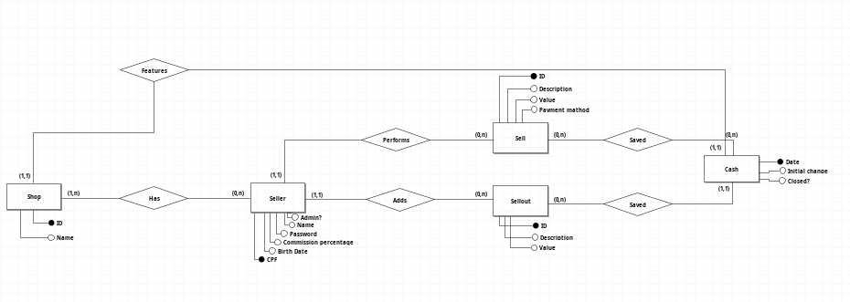

Developed by Thiago Chafado Almeida & João Eduardo Ferrari

In this README.md file, there is a brief summary of the software . To view the PDF file in Portuguese, please access it in the "Documentation" directory. The conceptual model and the logical model for the BD is also in the same folder.

<h1>Requirements</h1>

| ID   | Functionality              | Description                                                                                                                                  | User Type           |
| ---- | -------------------------- | -------------------------------------------------------------------------------------------------------------------------------------------- | ------------------- |
| RF1  | Add Sale                   | Users will be able to add a new sale, including a description of the sale, value, payment method, and the responsible seller. Each sale has a daily cash register associated  | Employee/Admin      |
| RF2  | Add Expense                | Users will be able to add a new financial expense, including a description of the expense and the corresponding value. Each expense has a daily cash register associated                    | Employee/Admin      |
| RF3  | Manage Seller                 | The owner (Super user) will be able to manage a new seller. Each seller will have a name,cpf, commission percentage and date of birth. They will have their own monthly and annual sales table. | Admin               |
| RF4  | Generate Report            | The system will be able to generate monthly reports, consolidating sums of sales, expenses, and commissions for each seller.                | Admin               |
| RF5  | Cash Monitoring            | There will be a table on the main screen showing daily sales, along with a subtotal.                                                        | Employee/Admin      |
| RF6  | Dashboard                  | One of the screens will be a dashboard, containing charts, tables, and sales statistics, comparing with other months and previous years, etc.  | Employee/Admin               |
| RF7  | Login                      | The initial screen will be the store's login. The system will prompt for login or registration of a store profile.                            | Employee/Admin      |
| RF8  | Registration               | The super user will be able to create a new store profile, specifying its name and a password. Usefull in case the admin open new stores.                                             | Admin        |
| RF9  | Cash Closure               | The super user will be able to close the daily cash register. Once closed, it cannot be altered by employees, only by the admin.               | Admin               |
| RNF1 | Portability                | The system must be compatible with the most popular web browsers (Chrome, Edge, Firefox, Opera, etc).                                      |                     |
| RNF2 | Availability               | Access to the system should be available 24 hours a day, 7 days a week.                                                                       |                     |
| RNF3 | Development/Implementation Requirement | Programming Language: Javascript Database: PostgreSQL.                                                                     |                     |
| RNF4 | Usability                  | Provide users with a simple, modern, and responsive interface that adapts to each device used by the user.                                    |                     |
| RNF5 | Security                   | User identification, informing the system of who is using it.                                                                                 |                     |

<h1>Use case diagram</h1>

<h1> Conceptual model</h1>

<h1> Logical model</h1>

<h1>Prototypes</h1>
<h2>Wireframe Add New Sale</h2>

<h2>Wireframe Add New Exit</h2>

<h2> Wireframe Sales Table</h2>

